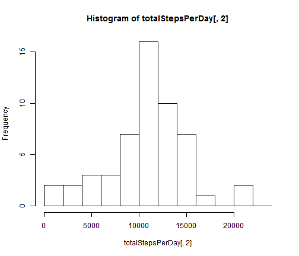
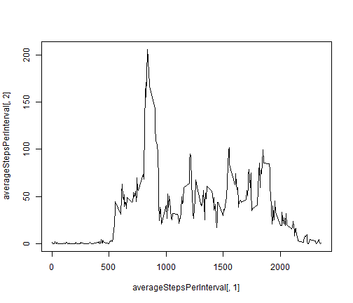
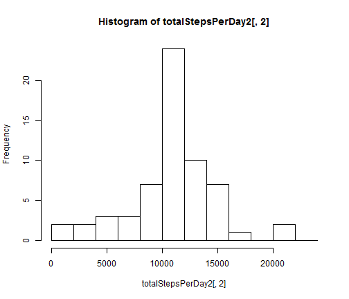

# Reproducible Research: Peer Assessment 1


## Loading and preprocessing the data

Set here the working directory and then load the data.


```r
setwd("C:/Users/Selim/Documents/GitHub/RepData_PeerAssessment1")
data <- read.csv("activity/activity.csv")
```


No transformation of the data is necessary.

## What is mean total number of steps taken per day?

Store in a new variable the data without the NA values.


```r
data2 <- data[!is.na(data$steps), ]
totalStepsPerDay <- aggregate(data2$steps ~ data2$date, data = data2, FUN = sum)
```


```r
hist(totalStepsPerDay[, 2], breaks = seq(from = -1, to = 25000, by = 2000))
```

 


```r
meanTotalSteps <- mean(totalStepsPerDay[, 2])
medianTotalSteps <- median(totalStepsPerDay[, 2])
```


We now compute the values of the mean and median found.


```r
meanTotalSteps
```

```
## [1] 10766
```

```r
medianTotalSteps
```

```
## [1] 10765
```


## What is the average daily activity pattern?

We now aggregate the steps per interval. As we want the mean over all the days, we use the function mean provided in R, for the aggregation.


```r
averageStepsPerInterval <- aggregate(data2$steps ~ data2$interval, data = data2, 
    FUN = mean)
```


We plot it.


```r
plot(averageStepsPerInterval[, 1], averageStepsPerInterval[, 2], type = "l")
```

 


Which interval contains the maximal value?


```r
averageStepsPerInterval[which.max(averageStepsPerInterval[, 2]), 1]
```

```
## [1] 835
```


## Imputing missing values

How many missing values are there in the data?


```r
sum(is.na(data[, 1]))
```

```
## [1] 2304
```


We replace each missing value on an interval ii by the mean of the number of steps on the interval ii on the non-missing values data.


```r
intervals <- unique(data[, 3])
newData <- data
for (ii in intervals) {
    newData[newData[, 3] == ii & is.na(newData[, 1]), 1] <- averageStepsPerInterval[averageStepsPerInterval[, 
        1] == ii, 2]
}
```


Now, we replicate the first analysis with this brand new dataset.


```r
totalStepsPerDay2 <- aggregate(newData$steps ~ newData$date, data = newData, 
    FUN = sum)
```


```r
hist(totalStepsPerDay2[, 2], breaks = seq(from = -1, to = 25000, by = 2000))
```

 


```r
meanTotalSteps2 <- mean(totalStepsPerDay2[, 2])
medianTotalSteps2 <- median(totalStepsPerDay2[, 2])
```


We now compute the values of the mean and median found.


```r
meanTotalSteps2
```

```
## [1] 10766
```

```r
medianTotalSteps2
```

```
## [1] 10766
```


## Are there differences in activity patterns between weekdays and weekends?
